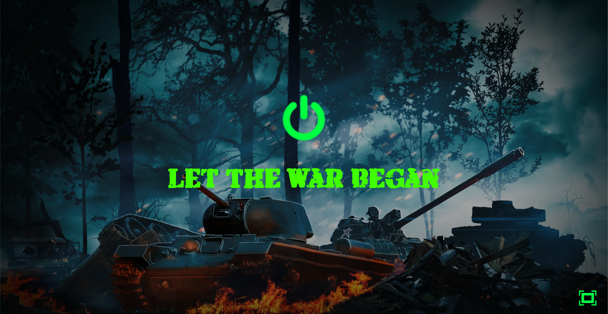
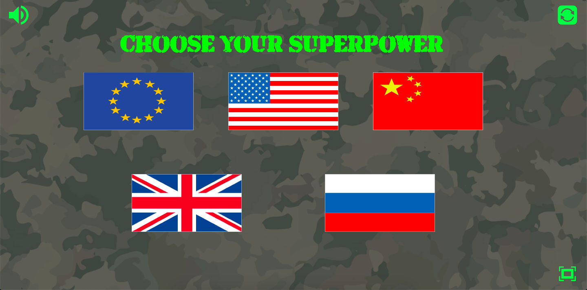
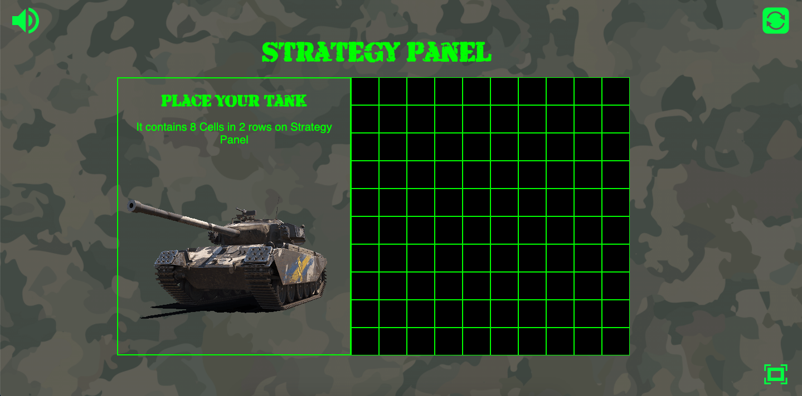
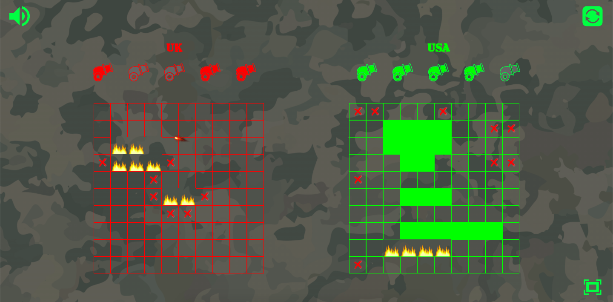
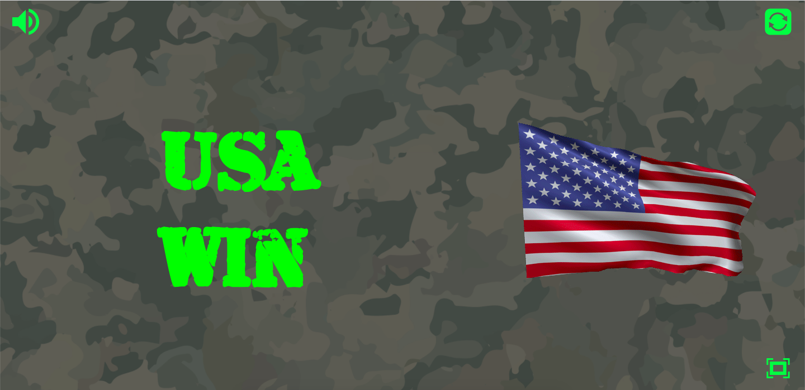
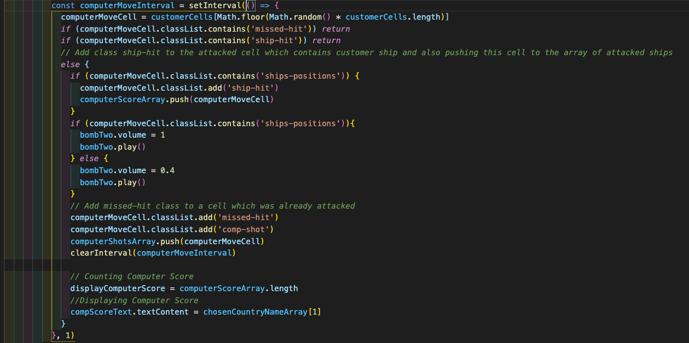
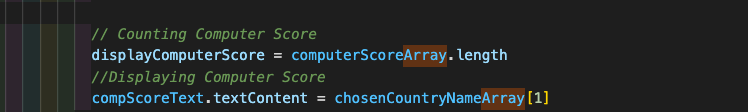
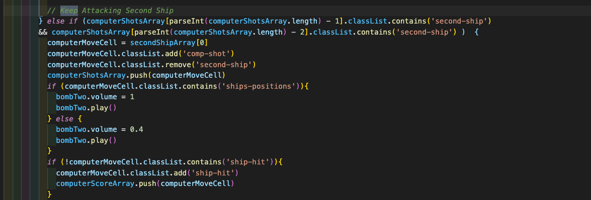
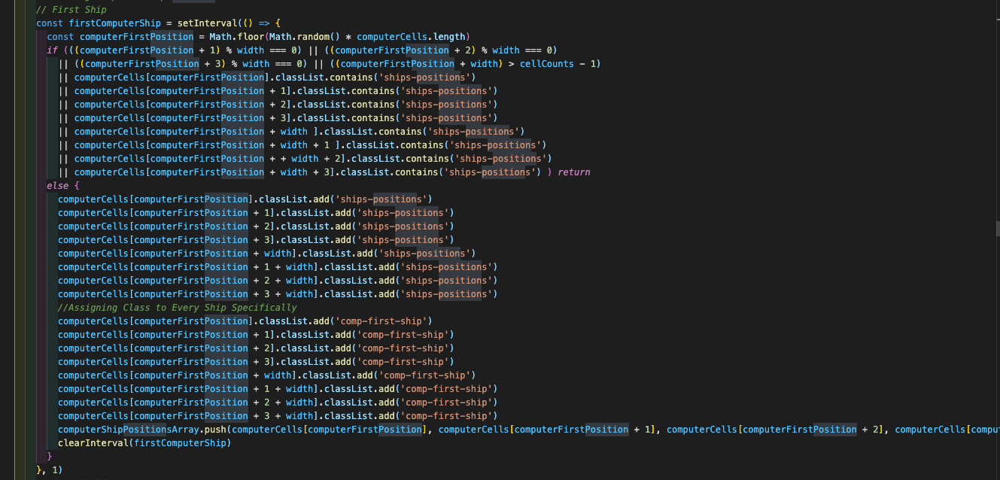

# General Assembly Project 1: Artillery
## https://ykbhrn.github.io/sei-project-one/
## **Overview.**
This was an individual project in the General Assembly. It was made in pure JavaScript. I choose to do Tanks, and Artillery game based on the classic battleship game.
 
***Timeframe*** for the project was one week
 

-------------------------
## Brief
* Render a game in the browser
* Design logic for winning & visually display which player won
* Include separate HTML / CSS / JavaScript files
* Stick with KISS (Keep It Simple Stupid) and DRY (Don't Repeat Yourself) principles
* Use **Javascript** for DOM manipulation
* Deploy your game online, where the rest of the world can access it
 
-------------------------
 
## **Technologies used.**
 
* JavaScript
* HTML
* CSS
* GitHub
* VScode
* Github
* Chrome Developer Tools
 
-------------------------
 
## How to use the App
### Picking sides
Choose your superpower, and also an enemy superpower
 

 
### Positions
 
You can see a grid map of the battlefield, and you need to position your tanks and artillery.
 

 
### Shooting
 
Your positions are on the right side, and your enemy is on the left side. By clicking on the specific grid cell on the left side, you're shooting a bomb on your enemy's artillery.
 

 
### Win
 
When the battle is over, you will see the flag of the winning side, and also the anthem of the winning nation/union.
 

 
-------------------------
 
## Development
 
### ***Game logic***
### a) Attack
 
* Most of the classes and components have "ship" in the name because originally I was doing battleships, but then I changed it for tanks and artillery, but functionality stays the same.
* Choosing a grid cell where the computer will shot is done with Math.random.
* After computer shot on the grid cell, this cell will be given class "missed-hit". The computer is looking for a grid cell to shot every millisecond because there is a setInterval method. If the grid cell contains class "missed-hit", then it continues to look for another cell.
 

 
* All customer and computer artillery position cells, have class "ship-position". Once the computer or customer hit cell with class "ship-position",
that cell will have added another class "hit". There is an array of elements with class "hit" on the customer and computer side, and the length of this array determine the score.
 

 
* Once computer hit cell with class "ship-position", then computer keep attacking the same artillery until it destroys it, and after that, it moves on.
 

 
### b) Position
 
Positioning computer ships is also done with Math.random and setInterval. Once the computer place artillery on the cell with class "ship-position", then it keeps going to find another position. The same thing will happen if the computer wants to place artillery too close to the edge of the grid.
 

 
 
 
-------------------------
 
## Wins
* With only three weeks of class, I managed to complete a fully functioning web-based game with a computer AI. This improved my confidence in JavaScript as well as my confidence in becoming a programmer.
* The computer AI works logically and can beat humans.
* Computer board is randomly generated every time, which was a daunting task on day one.
 
## Challenges
* Computer artillery positions were one of the biggest challenges. Those artillery positions were sometimes cover each other, and sometimes they went out from the cells grid.
* Another big challenge was making sure that once computer hit artillery position, then it gonna continue to hit around to hitting this artillery until it will be destroyed, otherwise, it wouldn't make sense if computer started to shot on the other side of the cells grid after it hit the artillery position.